# System Architecture Analysis
<!-- generated in 0.00s -->

## Overview

- **Project**: /home/tom/github/semcod/gix
- **Primary Language**: python
- **Languages**: python: 17, txt: 3, yaml: 2, toml: 2, shell: 2
- **Analysis Mode**: static
- **Total Functions**: 92
- **Total Classes**: 8
- **Modules**: 30
- **Entry Points**: 63

## Architecture by Module

### src.giton.cli
- **Functions**: 22
- **File**: `cli.py`

### src.giton.config
- **Functions**: 8
- **Classes**: 1
- **File**: `config.py`

### src.giton.history
- **Functions**: 8
- **Classes**: 1
- **File**: `history.py`

### src.giton.plugins
- **Functions**: 7
- **File**: `plugins.py`

### src.giton.policies
- **Functions**: 6
- **Classes**: 1
- **File**: `policies.py`

### src.giton.shell
- **Functions**: 6
- **File**: `shell.py`

### src.giton.repo_config
- **Functions**: 6
- **Classes**: 1
- **File**: `repo_config.py`

### examples.advanced.main
- **Functions**: 5
- **File**: `main.py`

### src.giton.context
- **Functions**: 5
- **Classes**: 1
- **File**: `context.py`

### src.giton.catalog
- **Functions**: 4
- **Classes**: 1
- **File**: `catalog.py`

### src.giton.runner
- **Functions**: 4
- **Classes**: 2
- **File**: `runner.py`

### examples.testing.sample_project.src.example
- **Functions**: 3
- **File**: `example.py`

### src.giton.interactive
- **Functions**: 3
- **File**: `interactive.py`

### src.giton.hooks
- **Functions**: 3
- **File**: `hooks.py`

### examples.basic.main
- **Functions**: 2
- **File**: `main.py`

## Key Entry Points

Main execution flows into the system:

### src.giton.cli.history_clean
> Run `git rebase -i --autosquash` safely with a backup ref.

Default base is the tracked upstream. Records `refs/giton/backup/clean-<ts>`
pointing at H
- **Calls**: history_app.command, typer.Option, typer.Option, typer.Option, src.giton.context.repo_root, history.list_log, console.print, history.make_backup_ref

### src.giton.cli.fixup
> Create a `fixup!` commit from currently staged changes.

Records a backup ref under `refs/giton/backup/fixup-<ts>` before
running so the operation is 
- **Calls**: app.command, typer.Option, typer.Option, src.giton.context.repo_root, None.stdout.strip, None.stdout.strip, console.print, history.make_backup_ref

### src.giton.cli.hook_commit_msg
> Validate the commit message before the commit completes.

Git invokes this hook with the path to the message file as `$1`.
On policy errors we exit no
- **Calls**: hook_app.command, typer.Argument, src.giton.context.collect, None.strip, cleaned.partition, subject.strip, body.strip, repo_config.load

### src.giton.policies._check_conventional_commits
- **Calls**: ctx.last_commit_subject.strip, int, bool, opts.get, opts.get, len, findings.append, None.join

### src.giton.plugins.show_catalog
- **Calls**: Table, table.add_column, table.add_column, table.add_column, table.add_column, set, catalog.CATALOG.items, console.print

### src.giton.cli.policy_check
> Run only the built-in policy engine for the given trigger.
- **Calls**: policy_app.command, typer.Option, src.giton.context.collect, repo_config.load, policies.evaluate, console.print, typer.Exit, console.print

### src.giton.plugins.show_table
- **Calls**: src.giton.config.load_plugins, Table, table.add_column, table.add_column, table.add_column, table.add_column, table.add_column, table.add_row

### src.giton.cli.init
> Install giton git hooks in the current repository.
- **Calls**: app.command, typer.Option, src.giton.context.repo_root, install_hooks, console.print, console.print, console.print, typer.Exit

### src.giton.cli.history_log
> Show the commits eligible for the next push.
- **Calls**: history_app.command, typer.Option, typer.Option, src.giton.context.repo_root, history.list_log, console.print, console.print, typer.Exit

### src.giton.hooks.install
- **Calls**: src.giton.hooks.hooks_dir, hd.exists, FileNotFoundError, target.exists, target.write_text, target.chmod, written.append, target.with_suffix

### src.giton.interactive.choose
> Pick one of `options` by index. Returns `default` when not on TTY.
- **Calls**: console.print, enumerate, src.giton.interactive.is_tty, console.print, None.strip, int, len, console.print

### examples.advanced.main.main
> Run all advanced examples.
- **Calls**: console.print, examples.advanced.main.demonstrate_catalog, examples.advanced.main.demonstrate_plugin_management, examples.advanced.main.demonstrate_hooks, examples.advanced.main.demonstrate_trigger_sequence, console.print, console.print, console.print

### src.giton.cli.status
> Show repo summary.
- **Calls**: app.command, src.giton.context.collect, console.print, console.print, console.print, console.print, typer.Exit, console.print

### src.giton.cli.policy_list
> Show currently active policies in this repo.
- **Calls**: policy_app.command, src.giton.context.repo_root, repo_config.load, console.print, console.print, typer.Exit, cfg.policy, console.print

### src.giton.policies._check_no_secrets
- **Calls**: None.join, opts.get, rx.search, ctx.staged_diff.splitlines, re.compile, findings.append, line.startswith, Finding

### src.giton.cli.policy_init
> Write a default `.giton/config.yaml` into the repo.
- **Calls**: policy_app.command, typer.Option, src.giton.context.repo_root, repo_config.write_default, console.print, console.print, typer.Exit, path.relative_to

### src.giton.catalog.list_categories
- **Calls**: CATALOG.items, out.values, dict, None.append, v.sort, sorted, out.items, out.setdefault

### src.giton.hooks.uninstall
- **Calls**: src.giton.hooks.hooks_dir, target.exists, target.unlink, target.with_suffix, backup.exists, removed.append, target.read_text, backup.rename

### src.giton.cli.uninit
> Remove giton hooks from the current repository (restore backups).
- **Calls**: app.command, src.giton.context.repo_root, uninstall_hooks, console.print, console.print, typer.Exit, len

### src.giton.history.list_log
> Return (sha, subject) pairs for recent commits.
- **Calls**: out.splitlines, args.append, src.giton.history._git, line.partition, rows.append, sha.strip, subj.strip

### src.giton.history.autosquash
> Run `git rebase -i --autosquash <base>`.

With `interactive=False` (default) we set `GIT_SEQUENCE_EDITOR` to convert
"pick" to "fixup" for commits tha
- **Calls**: dict, src.giton.history._git, tempfile.NamedTemporaryFile, f.write, os.chmod, src.giton.history._git, os.unlink

### src.giton.policies.evaluate
- **Calls**: CHECKS.items, repo_cfg.policy, opts.get, out.extend, fn, out.append, Finding

### src.giton.shell.run
- **Calls**: console.print, console.print, Panel, input, console.print, src.giton.shell.dispatch, console.print

### src.giton.cli._root
- **Calls**: app.callback, typer.Option, console.print, typer.Exit, typer.echo, ctx.get_help

### src.giton.cli.doctor
> Quick environment check.
- **Calls**: app.command, console.print, src.giton.context.repo_root, console.print, plug.show_table, shutil.which

### src.giton.repo_config.load
- **Calls**: src.giton.repo_config._deep_merge, RepoConfig, path.exists, RepoConfig, yaml.safe_load, path.read_text

### src.giton.interactive.confirm
> Ask a yes/no question. Returns `default` when not on a TTY.
- **Calls**: src.giton.interactive.is_tty, None.lower, console.print, None.strip, input

### src.giton.policies._check_max_file_size
- **Calls**: int, findings.append, opts.get, p.stat, Finding

### src.giton.history.make_backup_ref
> Create `refs/giton/backup/<prefix>-<timestamp>` pointing at HEAD.
- **Calls**: None.strftime, src.giton.history.head_sha, src.giton.history._git, _dt.datetime.now

### src.giton.policies._check_no_wip
- **Calls**: ctx.last_commit_subject.strip, opts.get, re.search, Finding

## Process Flows

Key execution flows identified:

### Flow 1: history_clean
```
history_clean [src.giton.cli]
  └─ →> repo_root
      └─> _run
```

### Flow 2: fixup
```
fixup [src.giton.cli]
  └─ →> repo_root
      └─> _run
```

### Flow 3: hook_commit_msg
```
hook_commit_msg [src.giton.cli]
  └─ →> collect
      └─> repo_root
          └─> _run
      └─> _run
```

### Flow 4: _check_conventional_commits
```
_check_conventional_commits [src.giton.policies]
```

### Flow 5: show_catalog
```
show_catalog [src.giton.plugins]
```

### Flow 6: policy_check
```
policy_check [src.giton.cli]
  └─ →> collect
      └─> repo_root
          └─> _run
      └─> _run
```

### Flow 7: show_table
```
show_table [src.giton.plugins]
  └─ →> load_plugins
      └─> ensure_user_dirs
```

### Flow 8: init
```
init [src.giton.cli]
  └─ →> repo_root
      └─> _run
```

### Flow 9: history_log
```
history_log [src.giton.cli]
  └─ →> repo_root
      └─> _run
```

### Flow 10: install
```
install [src.giton.hooks]
  └─> hooks_dir
```

## Key Classes

### src.giton.repo_config.RepoConfig
- **Methods**: 3
- **Key Methods**: src.giton.repo_config.RepoConfig.policy, src.giton.repo_config.RepoConfig.hook, src.giton.repo_config.RepoConfig.fail_on_policy

### src.giton.config.PluginRecord
- **Methods**: 2
- **Key Methods**: src.giton.config.PluginRecord.to_dict, src.giton.config.PluginRecord.from_dict

### src.giton.context.GitContext
- **Methods**: 2
- **Key Methods**: src.giton.context.GitContext.diff_file, src.giton.context.GitContext.paths_arg

### src.giton.runner.PluginResult
- **Methods**: 1
- **Key Methods**: src.giton.runner.PluginResult.ok

### src.giton.runner.TriggerOutcome
- **Methods**: 1
- **Key Methods**: src.giton.runner.TriggerOutcome.ok

### src.giton.history.GitResult
- **Methods**: 1
- **Key Methods**: src.giton.history.GitResult.ok

### src.giton.policies.Finding
- **Methods**: 1
- **Key Methods**: src.giton.policies.Finding.is_error

### src.giton.catalog.CatalogEntry
- **Methods**: 0

## Data Transformation Functions

Key functions that process and transform data:

### src.giton.runner._format_command
- **Output to**: cmd.format, ctx.paths_arg, str, str, ctx.diff_file

## Behavioral Patterns

### recursion__deep_merge
- **Type**: recursion
- **Confidence**: 0.90
- **Functions**: src.giton.repo_config._deep_merge

## Public API Surface

Functions exposed as public API (no underscore prefix):

- `src.giton.cli.history_clean` - 30 calls
- `src.giton.cli.fixup` - 28 calls
- `src.giton.shell.dispatch` - 25 calls
- `src.giton.cli.hook_commit_msg` - 24 calls
- `examples.basic.main.test_basic_giton_usage` - 20 calls
- `examples.advanced.main.demonstrate_plugin_management` - 19 calls
- `src.giton.plugins.show_catalog` - 14 calls
- `examples.advanced.main.demonstrate_catalog` - 13 calls
- `src.giton.cli.policy_check` - 13 calls
- `src.giton.plugins.show_table` - 13 calls
- `src.giton.context.collect` - 13 calls
- `examples.advanced.main.demonstrate_trigger_sequence` - 12 calls
- `src.giton.cli.init` - 12 calls
- `src.giton.cli.history_log` - 12 calls
- `src.giton.plugins.install_from_catalog` - 12 calls
- `src.giton.hooks.install` - 12 calls
- `src.giton.runner.run_trigger` - 11 calls
- `src.giton.interactive.choose` - 10 calls
- `examples.advanced.main.demonstrate_hooks` - 9 calls
- `examples.advanced.main.main` - 9 calls
- `src.giton.cli.status` - 9 calls
- `src.giton.cli.policy_list` - 9 calls
- `src.giton.cli.policy_init` - 8 calls
- `src.giton.catalog.list_categories` - 8 calls
- `src.giton.hooks.uninstall` - 8 calls
- `src.giton.cli.uninit` - 7 calls
- `src.giton.history.list_log` - 7 calls
- `src.giton.history.autosquash` - 7 calls
- `src.giton.policies.evaluate` - 7 calls
- `src.giton.shell.run` - 7 calls
- `src.giton.config.load_plugins` - 6 calls
- `src.giton.cli.doctor` - 6 calls
- `src.giton.repo_config.load` - 6 calls
- `src.giton.interactive.confirm` - 5 calls
- `src.giton.config.save_plugins` - 4 calls
- `src.giton.config.remove_plugin` - 4 calls
- `src.giton.history.make_backup_ref` - 4 calls
- `src.giton.repo_config.write_default` - 4 calls
- `src.giton.config.upsert_plugin` - 3 calls
- `src.giton.cli.plugin_install_category` - 3 calls

## System Interactions

How components interact:

```mermaid
graph TD
    history_clean --> command
    history_clean --> Option
    history_clean --> repo_root
    fixup --> command
    fixup --> Option
    fixup --> repo_root
    fixup --> strip
    hook_commit_msg --> command
    hook_commit_msg --> Argument
    hook_commit_msg --> collect
    hook_commit_msg --> strip
    hook_commit_msg --> partition
    _check_conventional_ --> strip
    _check_conventional_ --> int
    _check_conventional_ --> bool
    _check_conventional_ --> get
    show_catalog --> Table
    show_catalog --> add_column
    policy_check --> command
    policy_check --> Option
    policy_check --> collect
    policy_check --> load
    policy_check --> evaluate
    show_table --> load_plugins
    show_table --> Table
    show_table --> add_column
    init --> command
    init --> Option
    init --> repo_root
    init --> install_hooks
```



## Reverse Engineering Guidelines

1. **Entry Points**: Start analysis from the entry points listed above
2. **Core Logic**: Focus on classes with many methods
3. **Data Flow**: Follow data transformation functions
4. **Process Flows**: Use the flow diagrams for execution paths
5. **API Surface**: Public API functions reveal the interface

## Context for LLM

Maintain the identified architectural patterns and public API surface when suggesting changes.